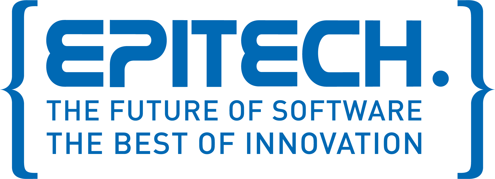

# C POOL - PART 1

## Overview

The C Pool is 3 weeks of hard coding and tryharding 9am-9pm min to discover C language. The C Pool is splited in 2 parts. The first is composed by several exercices in each days (6 to 21 exercices per day). And the second is based on little project.

Communication between all students is very helpful and faciliate learning. It's the perfect way to meet friends, colleague and create affinities.

## My Experience

It was my first time I worked with my promotion mates. I had one year High School Python class experience, and I had an adaptation time between Python and C !

It was awesome ! It was the really first time I've ever tryharded so hard ! And what a reward to have a A at the end of the pool. Great moment when I met my promotion mates and friends.
