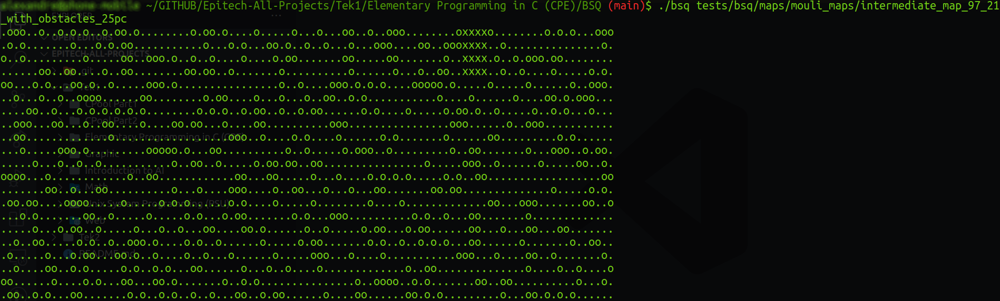
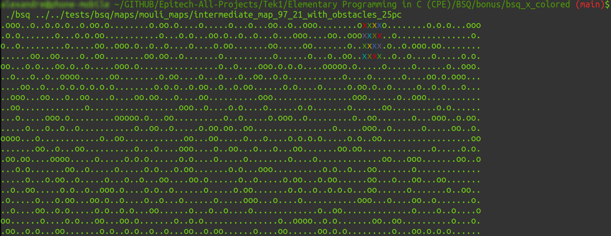

# BSQ - Find the Biggest Square

## Overview

The BSQ project is our first algorithmic project when we need to implement any algorithm to find as quickly as possible the biggest square.

To solve this problem, I more or less followed this algorithm :

____

I realised my first little bonus on this project. I colored the answer to be visiblier.

