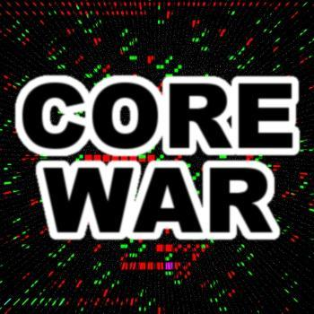
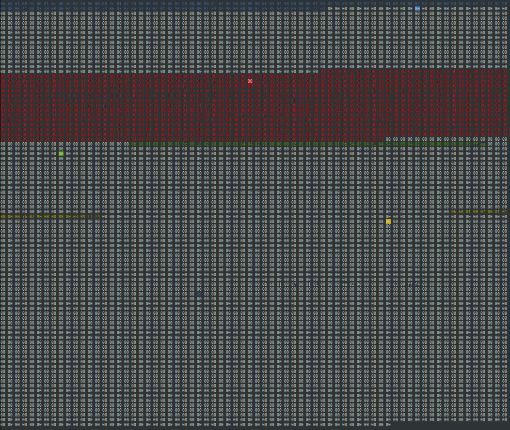

<p align="center"></p>

# Corewar


## Overview

The Corewar project is to create an Assembly Compiler and also a Virtual Machine (VM). The goal is to write in assembly code some champions, from the 1984's Corewar Game, which will be launch in the VM and would fight in them.

I really apreciate to work on this huge project ! I learnt a lot of things about the basics of how a PC works ! Verry difficult to understand the subject because Epitech gives us more than 20 pages of subjects.

We almost have a Module Mark A but we had 3 coding style mistakes :sweat:.

## How to use


#### ASM
```
USAGE:
	./asm/asm file_name[.s]

DESCRIPTION
	file_name	file in assembly language to be converted into file_name.cor, an
			executable in the Virtual Machine.
```

#### Corewar
```
USAGE
	./corewar/corewar [-dump nbr_cycle] [[-n prog_number] [-a load_adresses] prog_name] ...

DESCRIPTION
	-dump nbr_cycle dumps the memory after the nbr_cycle execution (if the round isn't
			already over) with the following format: 32 bytes/line in
			hexadecimal (AOBCDEFE1DD3...)
	-n prog_number  sets the next program's number.  By default, the first free number
			in the parameter order
	-a load_address sets the next program's loading address.  When no address is
			specified, optimize the addresses so that the processes ar as far
			away from each other as prossible.  The addresses are MEM_SIZE modulo
```

## Bonus

<p align="center"></p>

We created a real interface developped in Ncurses where you can see the head of each champions executing all the instructions of the arena.

## Collaborations

- [Aboh Daniel Cedrick Kakou](https://github.com/Cedani)

- [Cyril Grosjean](https://github.com/CyrilGrosjean)

- [Florian Chanson](https://github.com/Blackoutburst)
