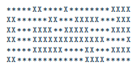
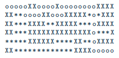

<p align="center"></p>

# Dante


## Overview

The Dante is a maze project composed in 2 differents parts:
- the **Generator**
- the **Solver**

The **Generator** is a generator of a complex and random maze.

The **Solver** is a solver of the shortest way to find the exit.

On each maze, the `Start` is in the top left of the map, and the `Finish` is in the bottom right-hand corner.

On the maze, `X` represent walls, `*` each free spaces and `o` the final result.

## How to use

#### generator
```
USAGE
    ./generator/generator x y [perfect]

DESCRIPTION
    x           width of the maze
    y           height of the maze
    perfect     only one path to solve the maze (optional)
```

#### solver
```
USAGE
    ./solver/solver maze.txt
```

## COLLABORATION
- [Rafik Merzouk](https://github.com/Belkadafi)
