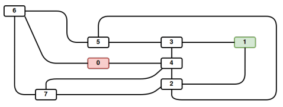

# Lem-In

## Overview

The Lem-In project is based on the data structures and the path finding of the ants which must organized themselves.

At the end of this project, I was able to build a real complex data structures with double linked lists.

## Collaborations

- [Cyril Grosjean](https://github.com/CyrilGrosjean)

- [Paul Narchal](https://github.com/Rafale25)
