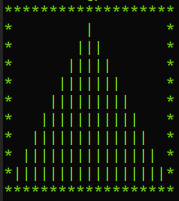
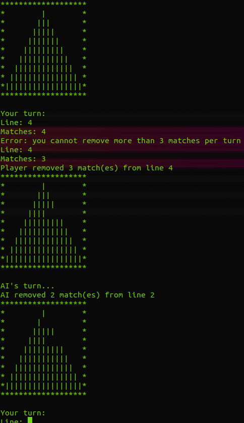

<p align="center"></p>

# Matchstick


## Overview

The Matchstick is a pretty easy game to create but the important thing in this project is the A.I. because the evaluation of the project is based on the complexity of the A.I.

## How to use

```
USAGE:
	./matchstick l n

DESCRIPTION
	l       number of lines of the pyramid
    n       maximum sticks you can remove
```

## Example

```
./matchstick 9 3
```

<p align="center"></p>
