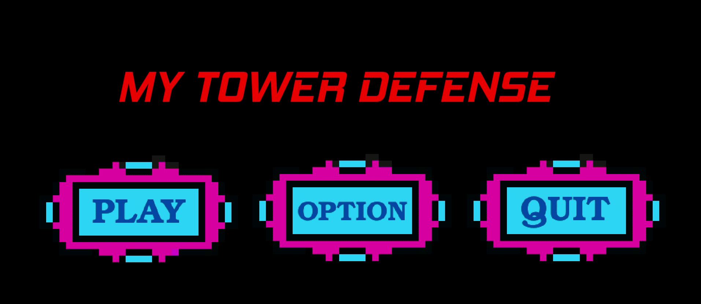
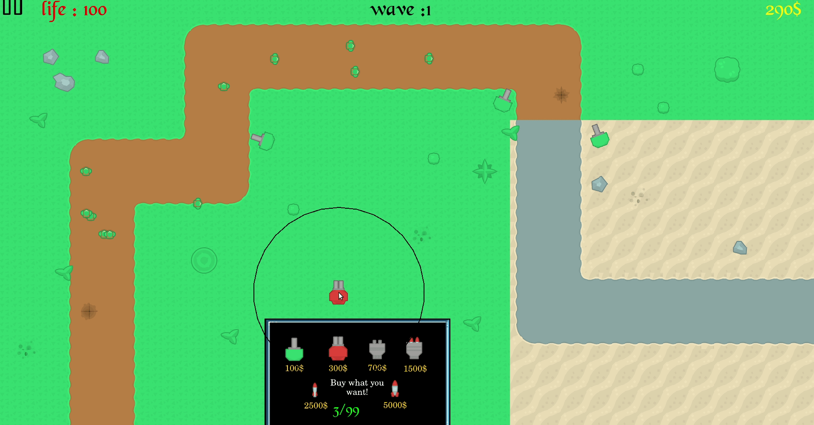
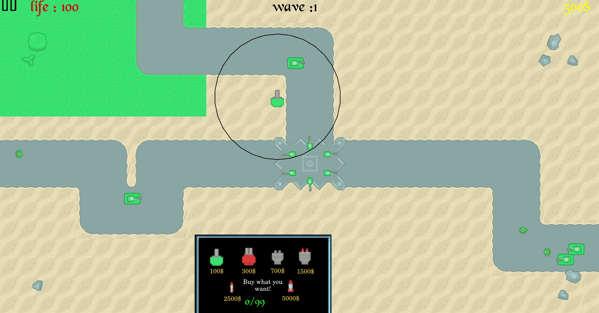
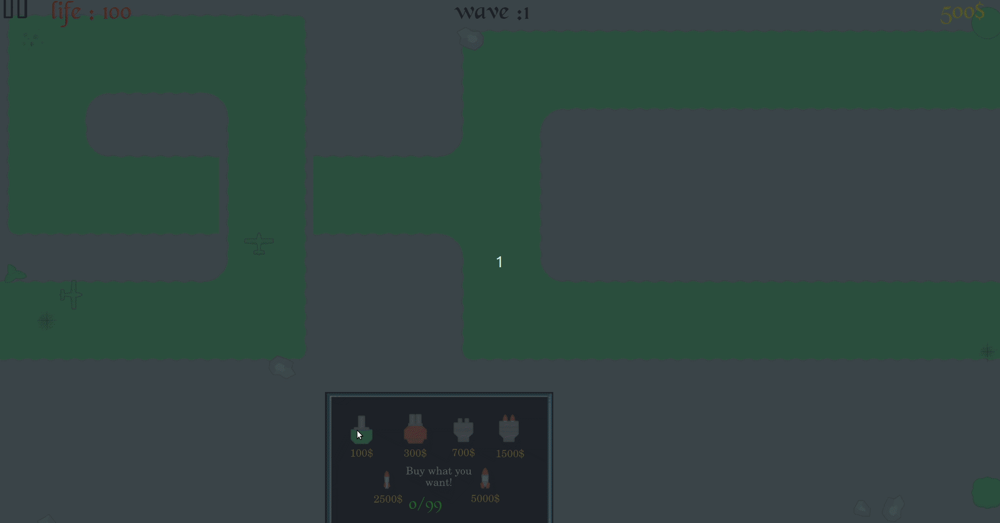

# MY DEFENDER :european_castle:



# DEPENDENCIES

**You need to have the CSFML packages installed.**

# HOW TO USE

```bash
> make re
> ./defender
```

# GAMEPLAY IMAGES








# COLLABORATION

- [Emeryck Clerin](https://github.com/lapprenti18)