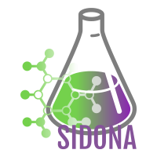
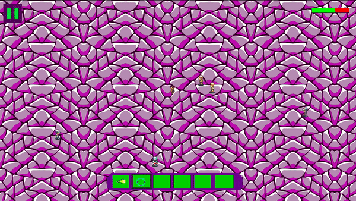

# MY RPG
SIDONA (RPG) :computer:

This is a project that was made during our first year at Epitech Montpellier. It is an RPG with a main quest and little side quests on the side. We made most of the sprites ouselves and coded everything using only the **CSFML library**.

*We are very happy to release this to the public. If you have any suggestions please put them in Issues so that we can maybe add, remove or fix anything that does not work. Thank you very much.*

# Website

**[Discover our Sidona Website Now!](http://sidona.ml)**

# Plateforms

To play the game on **MacOS** go in the **Linux_MacOS** directory and then launch the game with **./my_rpg_mac**.

Download [Mac OS version](Linux_MacOS) !

To play the game on **Linux** go in the **Linux_MacOS** directory and then launch the game with **./my_rpg_linux**.

Download [Linux version](Linux_MacOS) !

To play the game on **Windows** go in the **Windows** directory then go to the **exe rpg 2** directory. First install the **oalinst.exe** to be be able to get music in the game and finally launch the game with **rpg.exe** inside de **exe rpg 2** directory.

Download [Windows version](Windows/exe%20rpg%202) ! (download all folder and execute rpg.exe in the folder)

# Gameplay

# Collaboraters

---

## Richard Depierre

[Github](https://github.com/Richard-DEPIERRE)

---

## Alexandre Juan

[Github](https://github.com/Mitix-EPI)

---

## Rafik Merzouk

[Github](https://github.com/Belkadafi)

---

## Tom Seiguin

[Github](https://github.com/TomSgn)

---

# CREDITS

**Kenney.nl :**
[City tile set](https://www.kenney.nl/assets/rpg-urban-pack)
