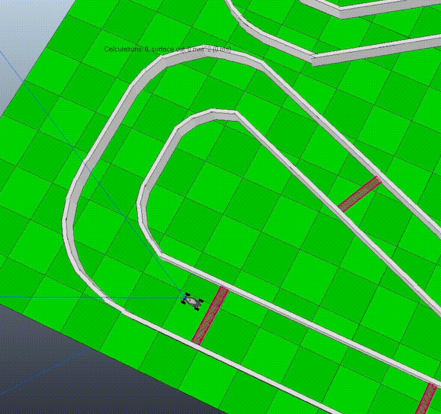

# Need 4 Stek (N4S) :car:

## COLLABORATION
- [Florian Chanson](https://github.com/Blackoutburst)

- [José Fernan](https://github.com/JoseFERNAN)


The N4S's goal is to develop an A.I. ables to drive any map, the fastest possible without crashing the car in any wall.

## DEPENDENCIES

**Follow the subject to install all dependencies to run the project correctly.**

## USAGE

```bash
> ./vrep.sh # Run CoppeliaSim script
> make re # Build project
> ./n4s # Run A.I.
```

## VISULATION


