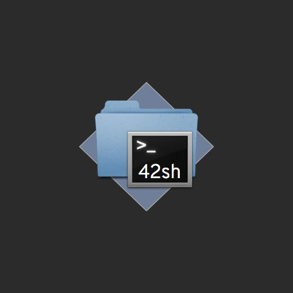

# 42sh

## Overview

The 42sh is based on the TCSH shell.

42sh is composed of:
 - Environment variables
 - `cd` command
 - Exec environment commands
 - `|` `&` `||` `&&` `>` `>>` `<<` `<` separators
 - globing
 - var interpreter
 - alias
 - repeat
 - terminal shortcuts

## Collaborations

- [Léo Sarochar](https://github.com/LeoSarochar)
- [Gabriel Knies](https://github.com/gabirel1)
- [Guillaume Robin](https://github.com/Guillaume1Robin)
- [Rafik Merzouk](https://github.com/Belkadafi)
