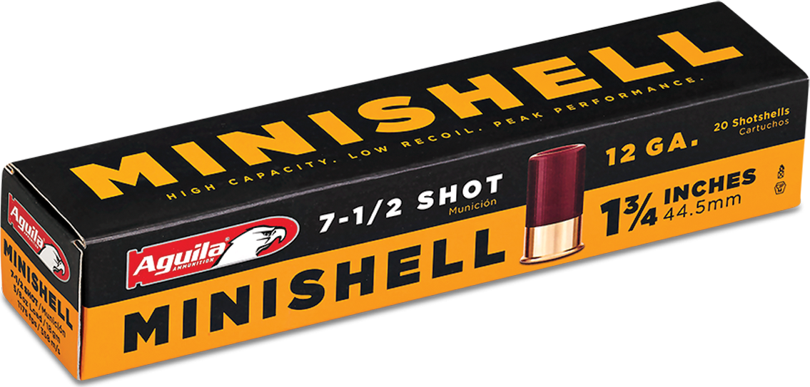

# Minishell 1

## Overview

The Minishell 1 is the first project which begins the series of creating complex shells.

Minishell 1 is composed of:
 - Environment variables
 - `cd` command
 - Exec environment commands