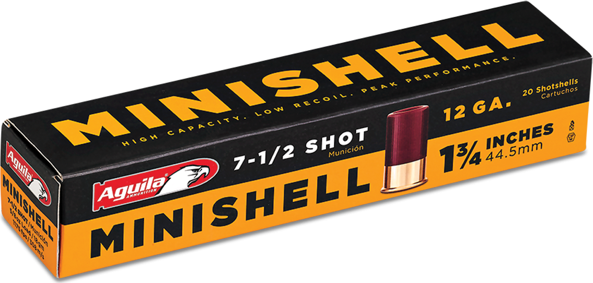

# Minishell 2

## Overview

The Minishell 2 is based on the TCSH shell.

Minishell 2 is composed of:
 - Environment variables
 - `cd` command
 - Exec environment commands
 - `||` `&&` `>` `>>` `<<` `<` separators
