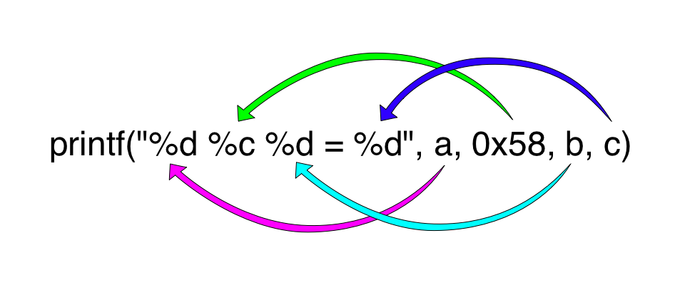
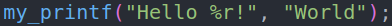
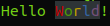

<p align="center"></p>

# My Printf


## Overview

The printf project give us the opportunity to discover the `va_list` arg and to try to implement the pointer to function. I really understood the C pointers from this project !

## How to use

```
Function my_printf :
                    int my_printf(char const *format, ...)
USAGE :
	%d : flag to display integers
	%s : flag to display strings
	%c : flag to display characters
	%p : flag to display pointers adresses
	%x : flag to display numbers to base 16 (min)
	%X : flag to display numbers to base 16 (maj)
	%o : flag to display numbers to base 8
	%b : flag to display numbers to base 2
	%u : flag to display only positives numbers
	%% : flag to display % normally
	%i : flag to display numbers positives and taller than integer
	%a [BONUS] : flag to display char ** (don't forget 0 at the end of the char **)
	%t [BONUS] : flag to display int * (don't forget 0 at the end of the int *)
	%r [BONUS] : flag to display str whith raimbow color
```

## Bonus

I developped two differents bonus which display arrays and they helped me a lot during my schooling. And also one which raimbow colorize the `char *`.

<p align="center"></p>

<p align="center"></p>
