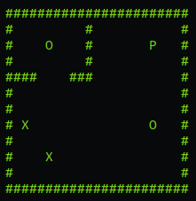

<p align="center"></p>

# My Sokoban


## Overview

The Sokoban project was our first project in nCurses and I had fun to recreate a sokoban game.

I did not have a A module mark because my printf wasn't enough complete.

## Details marks
```
- style major: 0
- style minor: 1
- style info: 0
- cov branches: 84.8 %
- cov lines: 98.1 %
- usage and input checks: 4/4
- basic moves: 4/4
- basic collisions and box on targets: 4/4
- intermediate moves and collisions: 6/6
- intermediate maps tests: 4/4
- intermediate winning and losing conditions: 2/2
- final moves and collisions: 6/6
- final maps tests: 4/4
- final winning and losing conditions: 2/2
- style mark: -1.0
```

## How to use

```
USAGE
	./my_sokoban map

DESCRIPTION
	map file representing the warehouse map, containing '#' for walls,
	'P' for the player, 'X' for boxes and 'O' for storage locations.
```
