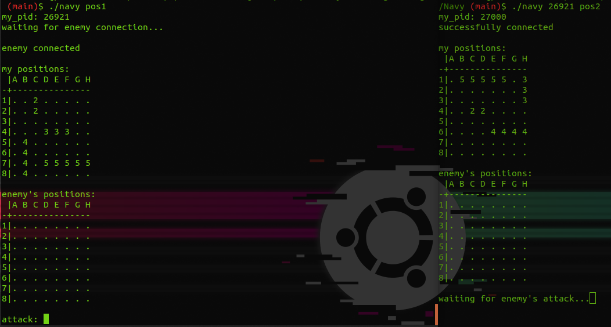

<p align="center"></p>

# Navy


## Overview

The Navy project is for me one of the funniest project of the year cause it's about creating a Battleship Multiplayer Game with terminal signals !

Connecting two terminals together was fun and very interesting !

## How to use

```
USAGE:
    ./navy [first_player_pid] navy_positions

DESCRIPTION:
    first_player_pid: only for the 2nd player. PID of the firsy player.
    navy_positions: file representing the positions of the ships.
```

## Collaboration

- [Mattis Litot](https://github.com/Litot-Mattis)
