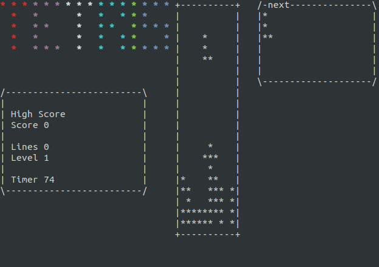

<p align="center"></p>

# Tetris


## Overview

The Tetris project allows us to *re*-use the Ncurse library. The goal is to familiarize ourselves to the interactive use of the terminal.

The project counts a lot of options and the final result is pretty cool.

## How to use

```
USAGE:
    ./tetris [options]

DESCRIPTION:
    --help                  Display this help
    -L --level={num}        Start Tetris at level num (def: 1)
    -l --key-left={K}       Move the tetrimino LEFT using the K key (def: left arrow)
    -r --key-right={K}      Move the tetrimino RIGHT using the K key (def: right arrow)
    -t --key-turn={K}       TURN the tetrimino clockwise 90d using the K key (def: top arrow)
    -d --key-drop={K}       DROP the tetrimino using the K key (def: down arrow)
    -q --key-quit={K}       QUIT the game using the K key (def: 'q' key)
    -p --key-pause={K}      PAUSE/RESTART the game using the K key (def: space bar)
    --map-size={row,col}    Set the numbers of rows and columns of the map (def: 20,10)
    -w --without-next       Hide next tetrimino (def: false)
    -D --debug              Debug mode (def: false)
```

## Collaboration

- [Alexis Lalande](https://github.com/Zuralex34)
