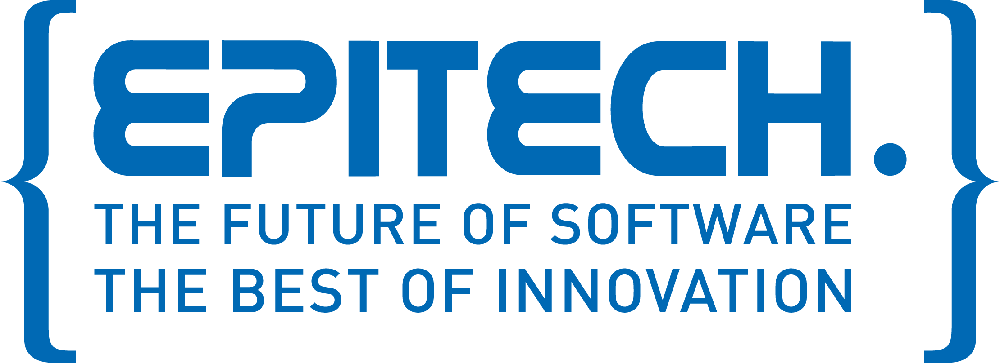

# CPP POOL

## Overview

The CPP Pool is 3 weeks of hard coding and tryharding to discover CPP language. The first three days, we improve our knowledge of C language developping a start of C++ class with C code. Then, we discover a lot of features of C++.

## My Experience

I really appreciate to have a pool of Object-Oriented programming language to understand and learn quickly. Class and methods were very fun to delve.
