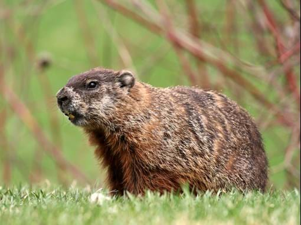

# Groundhog

## Overview

Our job was to extract some relevant information from the data received in real-time on standard input (each float representing a temperature), in order to detect weather aberrations (droughts, severe colds, hurricanes or any other extreme climatic condition whatsoever) as soon as possible.

I let some tests and the subject to share the computes.

## COLLABORATION
- [Jean-Louis Deurveilher](https://github.com/Narraxxas)