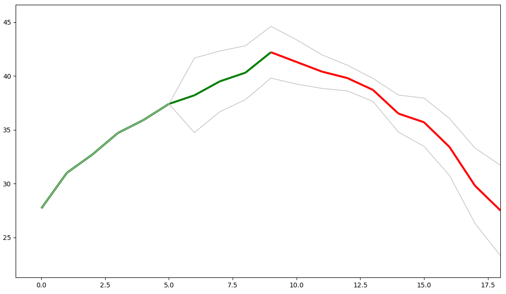

## Representation

<p align="center"></p>

## How to use

```bash
> ./graph.py <inputFile> <outputFile>
```

inputFile = input file that we can give to the program `groundhog` (example: `cat inputFile | ./groundhog 3`)

outputFile = redirected output in file (example: `./groundhog 3 > outputFile`)
