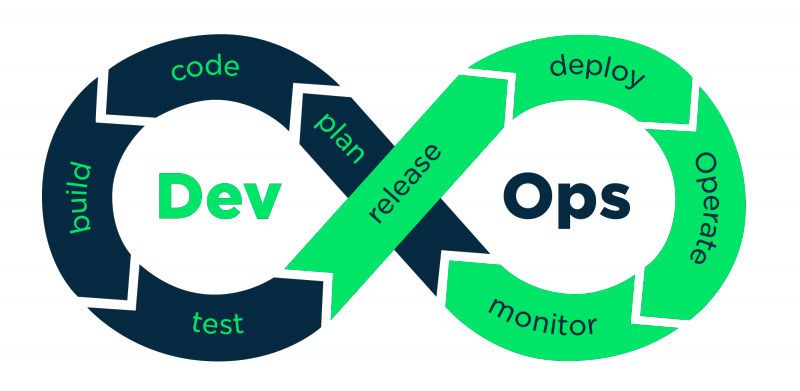

# Popeye

## Overview

Popeye is a project which introduces us Docker and the utilization of containers.
The project is splitted in 3 differents part:
- Poll -> Flask web app
- Result -> Javascript website
- Worker -> Java relation app

## Opinion

It was not my first docker project and so I easely finished the project !
