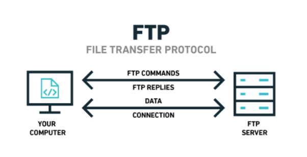

<p align="center"></p>

# My FTP


## Overview

The goal of this project is to create a **FTP server** with the RFC959 protocol.
The network communication is achieved through the use of TCP sockets

## How to use

Terminal 1
```bash
> make
> ./myftp 4040 .
```

Terminal 2
```bash
> telnet localhost 4040
```

## Opinion

I enjoyed to learn how to use sockets and understand the behaviour of each requests and responses of a computer.
