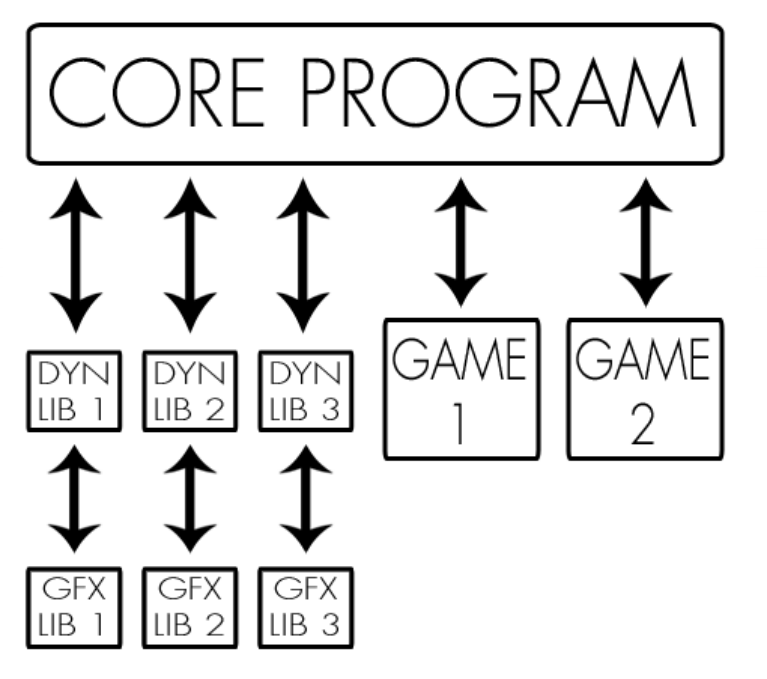

# Arcade

## Overview

**Arcade** is a gaming platform: a program that lets the user choose a game to play and keeps a register of player scores. To be able to deal with the elements of your gaming plateform at run-time, your graphics libraries and your games must be implemented as dynamic libraries, loaded at runtime. Each GUI available for the program must be used as a shared library that will be loaded and used dynamically by the main program.

We decided as **bonus** to be able to share ours and theirs librairies with a another group of students.

## Opinion

The subject forced us to split the work into three parts : the Core, the Game lib and the Graphic lib. We organized us to handle each parts. Moreover the fact that we decided to work with another group was very painful but rewarding at the end with a good result.
Finally, we're proud of our games and the display of them !

## Collaboration

- [Richard Depierre](https://github.com/Richard-DEPIERRE)
- [Titouan Bailly](https://github.com/titouan01)
