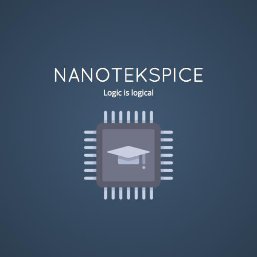

# NanoTekSpice

## Overview

**NanoTekSpice** is a logic simulator that builds a graph (the nodes of which will be simulated digital electronic components, inputs or outputs) from a configuration file, and injects values into that graph to get results.

## Opinion

I enjoyed creating generic architecture and reproduce electronic comportments. Also, some components were fun and very interested to reproduce and taught me how they really work.

## Collaboration

- [Cyril Grosjean](https://github.com/CyrilGrosjean)
