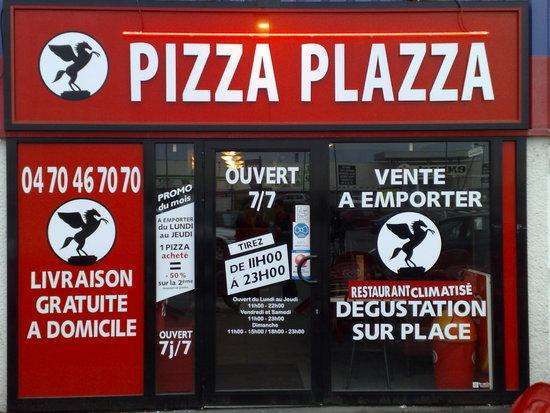

<p align="center"></p>

# Plazza


## Overview

The goal of this project is to recreate a automatic pizza restaurant where anyone can order differents type of pizzas. The restaurnat must be responsive and must adapt to the demand. Each kitchen is represented by **Thread Pool** and every employees in there are individual **Thread** who can handle and make 2 pizzas maximum (with one waiting for the other).

We had to handle **Thread pools**, differents **processes** and the managment of the **ingredients**.

## How to use

```bash
> make
> ./plazza 2 3 1000
```

## Bonus

We created a bonus where you can order pizzas with UI programmed with SFML. Enjoy it !

## Opinion

It was super cool to discover the thread on C++. Good notion to know and master.

## COLLABORATION
- [Jean-Louis Deurveilher](https://github.com/Narraxxas)
- [Richard Depierre](https://github.com/Richard-DEPIERRE)
