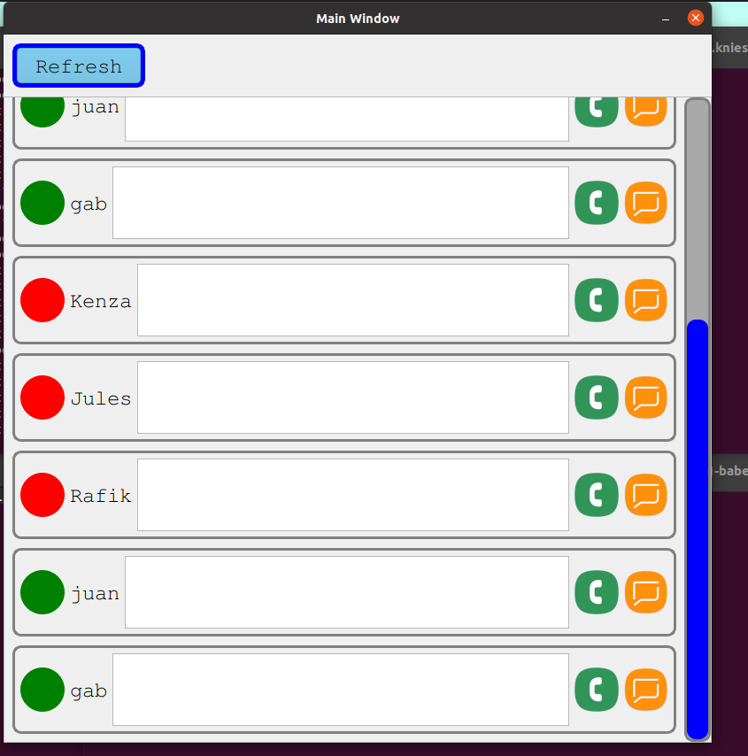
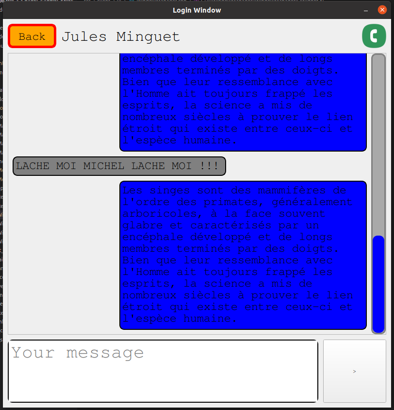

<p align="center"></p>

# Babel


## Overview

The babel is an Epitech project who's goal is to create a VoIP protocol and implement it in C++ using the following libraries:

- Qt (client side)
- Boost (server/client side)
- BoostAsio (server side)
- PortAudio (client side)
- Opus (client side)
- sqlite3 (server side)

The project should be cross platform (windows/linux) and consists of a server and a client. The server connects clients between them and handle messages/commands, but the voice communication should be done in P2P using udp between two clients.

<p align="center"></p>

## How to install the project

### Dependencies

    - conan (>=1.43.0)
    - CMake

### Run the project

*For the first time*
```bash
$> ./unix_setup.sh
```

*Once you already setup the project at least one time*
```bash
$> ./unix_compiler.sh
```

## COLLABORATION

- [Gabriel Knies](https://github.com/gabirel1) 

- [Rafik Merzouk](https://github.com/Belkadafi)

- [Jules Minguet](https://github.com/Hrothgor)
