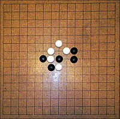

# Gomoku

## Overview

The gomoku is an Epitech project who's goal is to create the best algorithm to play the game of Gomoku. The [Gomoku](https://en.wikipedia.org/wiki/Gomoku) is a two-player strategy board game played on a 19x19 grid with a set of rules. The goal of the game is to get five of your pieces in a row (horizontally, vertically, or diagonally) before your opponent.

The subject indicated that we can use [Minimax algorithm](https://en.wikipedia.org/wiki/Minimax), [Neural Network](https://en.wikipedia.org/wiki/Neural_network), [Monte Carlo Tree Search](https://en.wikipedia.org/wiki/Monte_Carlo_tree_search), [Alpha-Beta Pruning](https://en.wikipedia.org/wiki/Alpha-beta_pruning) to solve the problem but no one was possible to introduce this kind of algorithms in the project (because we didn't have enough time to play -> 5s each round).
*No librairy available.*

So we decided to create a simple algorithm that will play the game of Gomoku:
- Basic Win the game if you can get five in a row
- Basic Defend the game if your opponent can get five in a row

We passed close to **70% of the tests**.

## COLLABORATION

- [Maximilien Drules](https://github.com/maximilien-alt)

- [Rafik Merzouk](https://github.com/Belkadafi)
