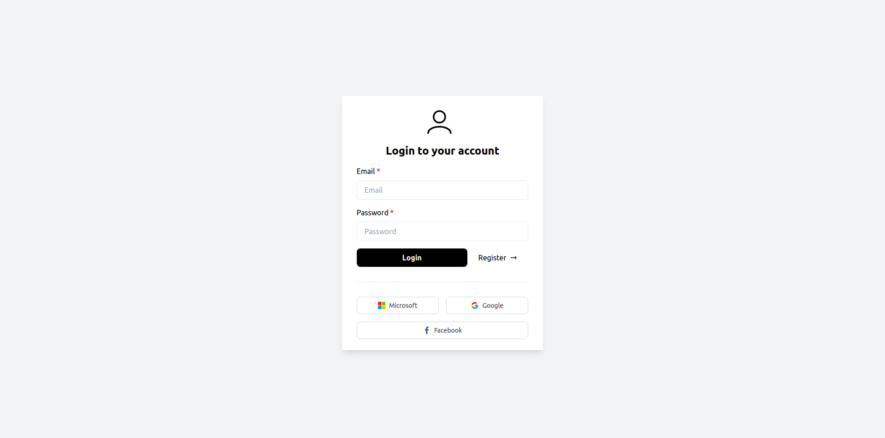
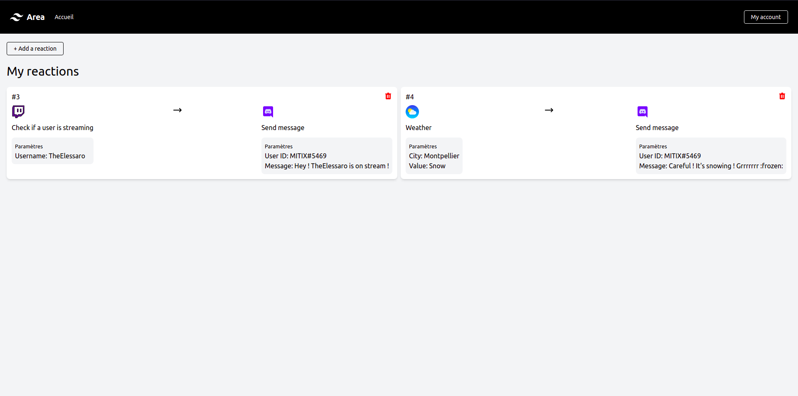
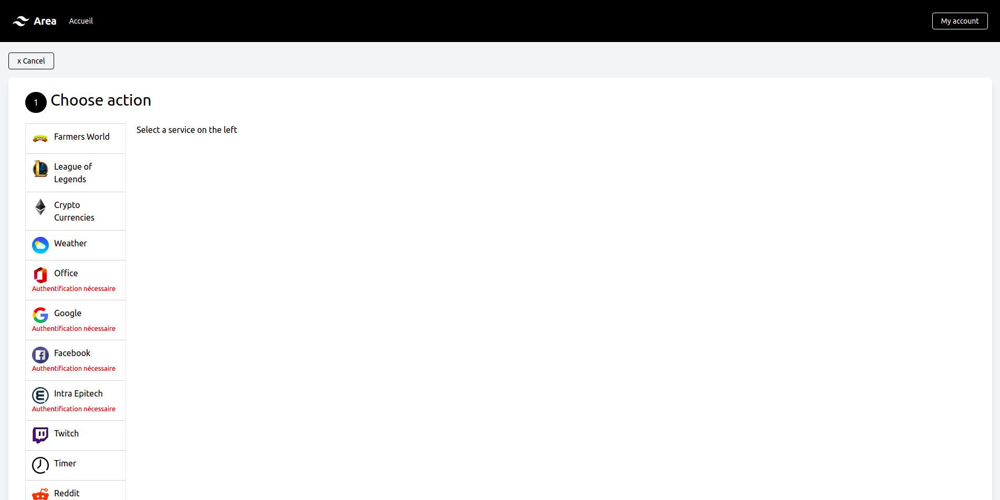
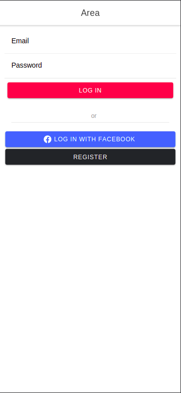
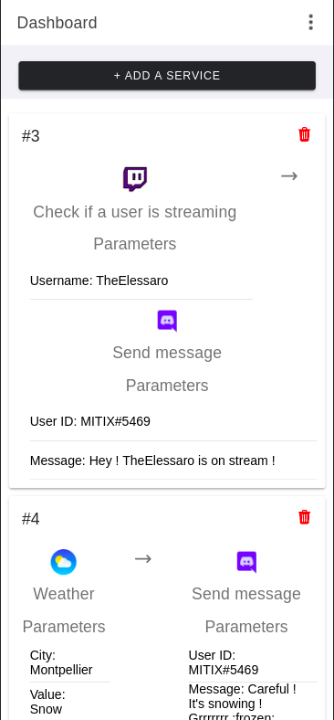
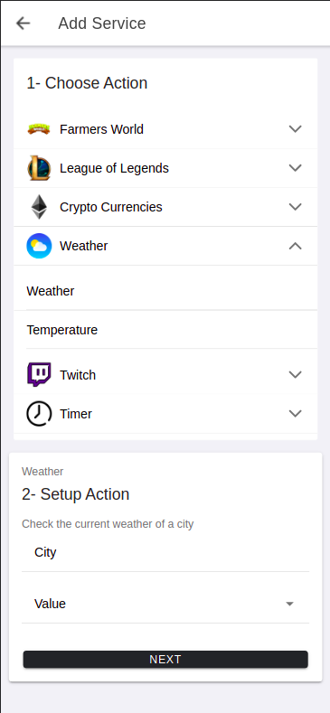

[](https://opensource.org/licenses/MIT)

# AREA


## Description of the project

The AREA project consists in the creation of a software suite that functions similarly to IFTTT and/or Zapier.
This software suite is a divided into 3 parts:

- A server where is implemented the API that will be used by the other parts of the software suite. It is also where the actions and reactions available to the users are implemented.

- A Web App that will be used by the users to interact with the software suite.

- A mobile app that will be used by the users to interact with the software suite.

## Languages

This project was developped using the following languages:

- Server: Python -> FastAPI
- Web App: TypeScript -> Angular
- Mobile App: TypeScript -> Angular
- Database: MySQL

---

## Getting Started

### 1. Dependencies :books:

- The entire project is based on containers to make the deploy easier. You must have [Docker :whale:](https://docs.docker.com/get-docker/) installed in your environment.

- Set a `.env` file with the following variables:
    - SPOTIFY_CLIENT
    - SPOTIFY_API
    - REDDIT_CLIENT
    - REDDIT_API
    - DISCORD_TOKEN
    - TWITCH_CLIENT_ID
    - TWITCH_CLIENT_SECRET
    - TWITCH_REFRESH_TOKEN
    - RIOT_API
    - CURRENCY_API

### 2. Running :rocket:

**How to run project**

```bash
$> docker-compose build
$> docker-compose up db
$> docker-compose up
```

If the web app doesn't build, you can try to run the following command:

```bash
$> docker-compose build --no-cache client_web
```

The [server](http://localhost:8080) should be available at http://localhost:8080

The [website](http://localhost:8081) should be available at http://localhost:8081

The [ionic app](http://localhost:8100) should be available at http://localhost:8100

The [adminer](http://localhost:8085) should be available at http://localhost:8085

---

## Presentation :camera:

### **Website**

---

#### Login:



---

#### Dashboard:



---

#### Add Service:



---

### **Mobile**

---
#### Login:



---

#### Dashboard:


---

#### Add Service



---

## Documentation :notebook:

[API Documentation](http://localhost:8080/docs#/): http://localhost:8080/docs#/

The front documentation is generated in `documentations/web-documentation`.

---

## COLLABORATION :heart:

- [Léo Sarochar](https://github.com/LeoSarochar)

- [Gabriel Knies](https://github.com/gabirel1)

- [Cyril Grosjean](https://github.com/CyrilGrosjean)

- [Rafik Merzouk](https://github.com/Belkadafi)
