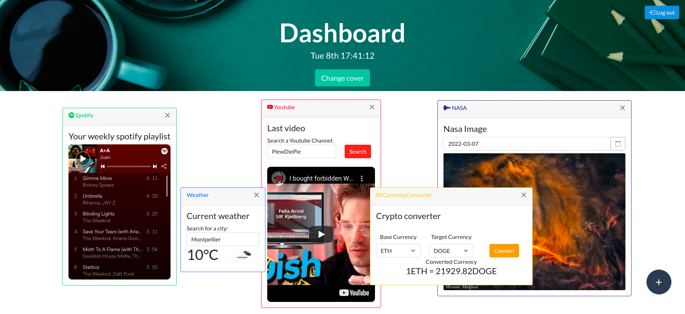
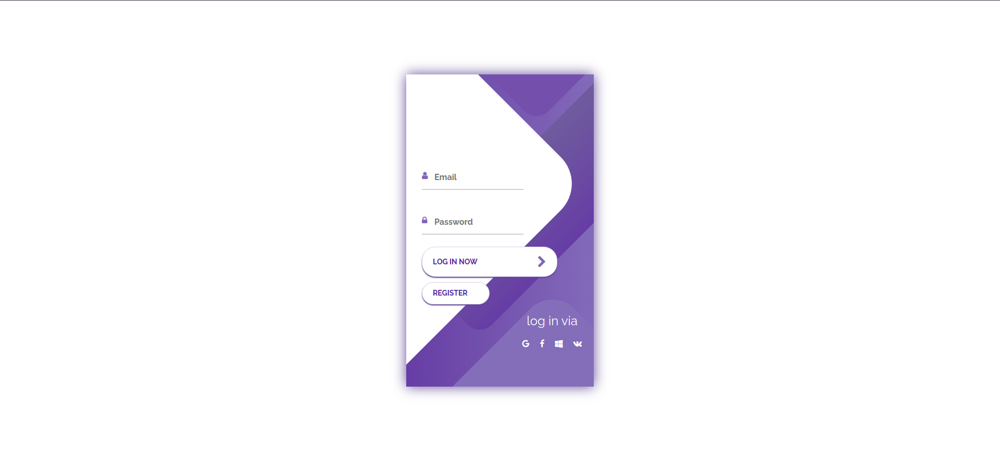

[](https://opensource.org/licenses/MIT)

# Dashboard


## Overview

The goal of this project is to create a dashboard where you can set differents widgets that will be displayed on the screen. These widgets are based on famous APIs' services. And several of them are based on the handle of the **oAuth2** connection.

## Getting Started

### 1. Dependencies :books:

- The entire project is based on containers to make the deploy easier. You must have [Docker :whale:](https://docs.docker.com/get-docker/) installed in your environment.

- Set a `.env` file with the following variables:
    - GOOGLE_CLIENT_ID
    - GOOGLE_CLIENT_SECRET
    - SPOTIFY_CLIENT_ID
    - SPOTIFY_CLIENT_SECRET
    - SPOTIPY_REDIRECT_URI

### 2. Running :rocket:

**How to run project**

```bash
$> docker-compose build
$> docker-compose up
```

The [server](http://localhost:8080) should be available at http://localhost:8080

The [website](http://localhost:4200) should be available at http://localhost:4200

The [adminer](http://localhost:8081) should be available at http://localhost:8081

---

## Presentation :camera:

#### Dashboard



---

#### Login



---

## Collaboration

- [Thanaël Fontaine](https://github.com/ThanaelFontaine)
